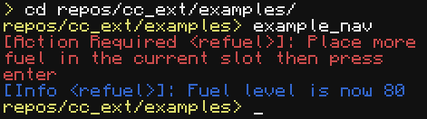

# Examples

This directory contains some examples of using the cc-ext library.

## example_nav.lua
Demonstrates navigation with `NavigationContext`, refueling with `RefuelStrategy`s, and scoped logging with `Logger`.

This image shows example output of the program where the turtle ran out of fuel. Since the `RefuelStrategy` was created with the simple `defaultHardcoded` stratagy, it blocked indefinitely until the user manually refueled it. Other strategies could exhibit more complex behavior, like having the turtle go to a location when it is low and then returning.

